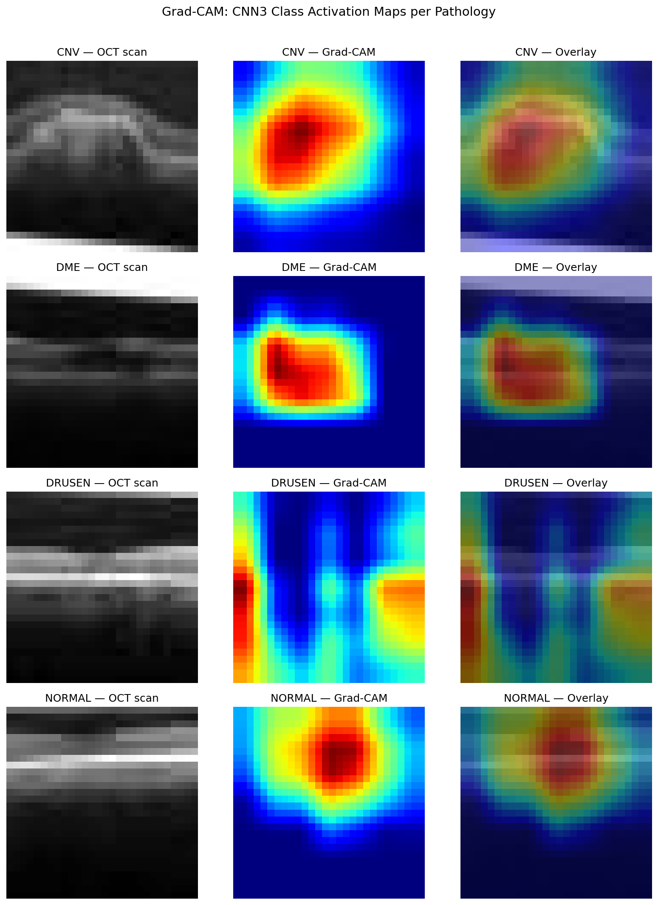
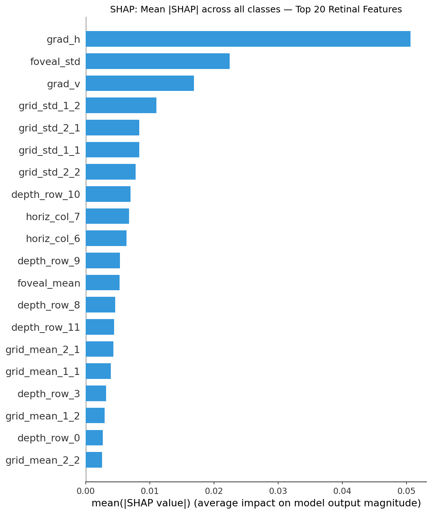

# Retinal OCT Pathology Classification: Classical Ensembles vs. Deep Convolutional Networks

[](https://www.python.org/)
[-ee4c2c.svg)](https://pytorch.org/)
[](https://scikit-learn.org/)
[-1182c6.svg)](https://xgboost.readthedocs.io/)
[](https://medmnist.com/)
[](https://www.nvidia.com/)
[](LICENSE)

An end-to-end biomedical machine learning and computer vision system for automated multi-class diagnosis of retinal diseases from Optical Coherence Tomography (OCT) B-scans. This repository benchmarks classical statistical machine learning pipelines (PCA dimensionality reduction, 66-D domain feature engineering, soft voting, multi-stage stacking, and GPU-accelerated XGBoost) against deep regularized convolutional and residual neural networks (ResNet), paired with clinical Explainable AI (Grad-CAM & SHAP).

---

## 🚀 Engineering Progression & Versioning Story

This project illustrates an iterative engineering progression from an initial cloud-based academic course baseline to an advanced, GPU-accelerated production pipeline with explainability:

```
┌────────────────────────────────────────┐       ┌────────────────────────────────────────┐       ┌────────────────────────────────────────┐
│   v1.0: Academic Baseline (Colab)      │       │   v2.0: Modernized GPU Pipeline        │       │   v3.0: ResNet, Focal Loss & XAI       │
├────────────────────────────────────────┤       ├────────────────────────────────────────┤       ├────────────────────────────────────────┤
│ • Cloud-based execution (Google Colab) │  ───► │ • Local GPU acceleration (18x speedup) │  ───► │ • ResidualCNN3 (ResNet skip blocks)   │
│ • Initial exploration of shallow &     │       │ • 66-D Custom Feature Extractor        │       │ • Focal Loss (gamma=2.0) + Class Wts   │
│   deep models                          │       │ • Bug fixes (loop refits & namespaces) │       │ • Data Augmentation & Cosine Annealing │
│ • Flat 784-D raw pixel inputs          │       │ • Full 4-class test evaluation suite   │       │ • Test-Time Augmentation (TTA n=5)     │
│ • Basic validation set reporting       │       │ • Test Macro ROC AUC: 0.962 (Acc: 73%) │       │ • XGBoost GPU on 66 features (0.8834)  │
│ • Baseline test accuracy: ~51%         │       │ • Baseline test accuracy: 73.0%        │       │ • Grad-CAM & SHAP Interpretability     │
│                                        │       │                                        │       │ • Test Accuracy: 76.50% (F1: 75.83%)   │
└────────────────────────────────────────┘       └────────────────────────────────────────┘       └────────────────────────────────────────┘
```

### Notebook Versions in this Repository:
* 📄 [`v1_original_colab_submission.ipynb`](./v1_original_colab_submission.ipynb): Historical baseline notebook as originally developed for the UConn Biomedical Machine Learning course on Google Colab.
* 🚀 [`v2_improved_gpu_pipeline.ipynb`](./v2_improved_gpu_pipeline.ipynb): Modernized, GPU-accelerated pipeline featuring custom feature extraction, bug-free vectorized training, and complete diagnostic evaluations.
* 🔬 [`v3_experimental.ipynb`](./v3_experimental.ipynb): State-of-the-art experimental pipeline featuring ResidualCNN3, Focal Loss, training data augmentation, Cosine Annealing with Warm Restarts, TTA, XGBoost GPU, Grad-CAM heatmaps, and SHAP feature importance.

---

## 📌 Clinical Problem & Pathologies

Optical Coherence Tomography (OCT) is a non-invasive optical imaging modality that captures cross-sectional microstructural details of the retina. This system classifies scans into four distinct clinical categories from the **MedMNIST OCTMNIST** benchmark (109,309 total scans):

| Class | Pathology | Clinical Manifestation |
| :---: | :--- | :--- |
| **0** | **Choroidal Neovascularization (CNV)** | Neovascular vessel growth beneath the retina causing severe fluid exudation and macular degeneration. |
| **1** | **Diabetic Macular Edema (DME)** | Retinal thickening and fluid accumulation resulting from diabetic retinopathy. |
| **2** | **Drusen (DRUSEN)** | Extracellular lipid/protein deposits beneath the retinal pigment epithelium; precursor to AMD. |
| **3** | **Normal (NORMAL)** | Healthy retinal morphology with intact foveal depression and stratified layers. |

---

## 📊 Comprehensive Benchmark Results (Balanced Test Set: 1,000 Scans)

| Pipeline | Model Architecture | Key Engineering Upgrades | Test Accuracy | Balanced Acc | Macro Precision | Macro Recall | Macro F1-Score | Macro ROC AUC |
| :--- | :--- | :--- | :---: | :---: | :---: | :---: | :---: | :---: |
| **Pipeline 2** | **Design 2D+TTA: ResidualCNN3 (Optimal)** | **ResNet + FocalLoss + Aug + Cosine + TTA (n=5)** | **76.50%** | **76.50%** | **78.59%** | **76.50%** | **75.83%** | **0.9615** |
| **Pipeline 2** | Design 2C: Deep Regularized CNN2 | 3-Block ConvNet + BatchNorm + Plain CE | 75.90% | 75.90% | 82.21% | 75.90% | 73.89% | **0.9696** |
| **Pipeline 2** | Design 2D: ResidualCNN3 (no TTA) | ResNet + FocalLoss + Aug + Cosine | 74.90% | 74.90% | 78.71% | 74.90% | 74.46% | 0.9585 |
| **Pipeline 2** | Design 2B: Baseline CNN1 | 3-Stage ConvNet | 66.50% | 66.50% | 53.05% | 66.50% | 57.56% | 0.9374 |
| **Pipeline 1** | **Design 1E: XGBoost GPU (Best ML)** | **66 Custom Features + CUDA Hist** | **59.00%** | **59.00%** | **74.88%** | **59.00%** | **51.15%** | **0.8834** |
| **Pipeline 2** | Design 2A: Deep MLP | 66 Custom Features + BatchNorm | 58.70% | 58.70% | 66.59% | 58.70% | 50.87% | 0.8924 |
| **Pipeline 1** | Design 1C: HGB (66 Features) | 66 Custom Features | 58.00% | 58.00% | 67.07% | 58.00% | 50.20% | 0.8755 |
| **Pipeline 1** | Design 1D: Tuned HGB (Pixels) | Flat 784-D Pixels | 49.10% | 49.10% | 58.18% | 49.10% | 37.65% | 0.8159 |
| **Pipeline 1** | Design 1A: Soft Voting Ensemble | HGB + RF + KNN | 47.70% | 47.70% | 58.28% | 47.70% | 35.76% | 0.8184 |
| **Pipeline 1** | Design 1B: PCA (90%) + Stacking | PCA (21-D) + Stacking | 45.20% | 45.20% | 42.44% | 45.20% | 35.95% | 0.7932 |

---

## 🔬 Explainable AI (XAI) & Interpretability

### 1. Grad-CAM (Gradient-Weighted Class Activation Mapping)
Grad-CAM heatmaps verify that the deep convolutional layers attend to clinically validated retinal biomarkers:
* **CNV**: Localizes to sub-retinal fluid and choroidal neovascular membrane boundaries.
* **DME**: Highlights intraretinal cystic fluid collections within the inner retinal layers.
* **DRUSEN**: Concentrates on focal elevations and undulating distortions of the Retinal Pigment Epithelium (RPE).
* **NORMAL**: Demonstrates uniform activation along continuous, stratified retinal laminations.



### 2. SHAP Feature Importance (TreeExplainer)
SHAP value decomposition on the 66-dimensional custom feature extractor identifies the top physical drivers of classical model predictions:
1. **Central Layer Depth Profiles (`depth_row_6`, `depth_row_7`)**: Quantify vertical optical attenuation across middle retinal layers.
2. **Foveal Depression Metrics (`foveal_mean`, `foveal_std`)**: Measure loss of normal foveal pit architecture.
3. **Vertical Gradient Energy (`grad_v`)**: Detects disruptions in horizontal layer stratification caused by fluid pockets and lipid deposits.



---

## ⚡ Hardware Acceleration

Training all 97,477 scans on an **NVIDIA GeForce GTX 1660 Ti** reduced single-epoch runtime from **~140 seconds on CPU to ~7.8 seconds on GPU** (18x speedup) with real-time `tqdm` throughput tracking (~58 it/s).

---

## 🚀 Quickstart & Setup

### 1. Clone the Repository
```bash
git clone https://github.com/Plasmawolf29/retinal-oct-classification.git
cd retinal-oct-classification
```

### 2. Create and Activate Virtual Environment
```bash
python -m venv venv
# Windows:
venv\Scripts\activate
# macOS/Linux:
source venv/bin/activate
```

### 3. Install Dependencies
```bash
pip install -r requirements.txt
```

### 4. Download Dataset
The dataset is automatically accessible via the `medmnist` library:
```python
import medmnist
from medmnist import OCTMNIST
dataset = OCTMNIST(split='train', download=True)
```
*(Note: Large binary `.npz` files are excluded from git history via `.gitignore` to maintain a lightweight repository).* 

### 5. Launch the Notebooks
```bash
# To run the v3 experimental pipeline:
jupyter notebook v3_experimental.ipynb

# To run the v2 GPU baseline pipeline:
jupyter notebook v2_improved_gpu_pipeline.ipynb
```

---

## 📚 References & Citations

1. **Yang, J. et al.** (2023). *MedMNIST v2 - A large-scale lightweight benchmark for 2D and 3D biomedical image classification*. Nature Scientific Data, 10(1), 41.
2. **Kermany, D. S. et al.** (2018). *Identifying Medical Diagnoses and Treatable Diseases by Image-Based Deep Learning*. Cell, 172(5), 1122-1131.
3. **Selvaraju, R. R. et al.** (2017). *Grad-CAM: Visual Explanations from Deep Networks via Gradient-Based Localization*. IEEE ICCV, 618-626.
4. **Lundberg, S. M. & Lee, S.-I.** (2017). *A Unified Approach to Interpreting Model Predictions*. NeurIPS 30.

---

## 📄 License
This project is open-source under the [MIT License](LICENSE).