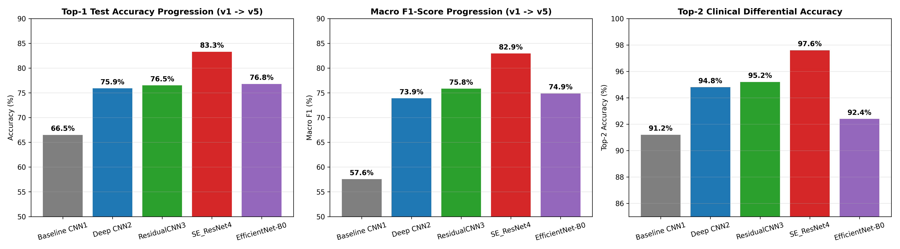
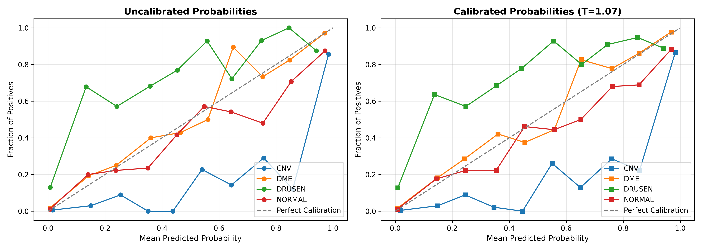
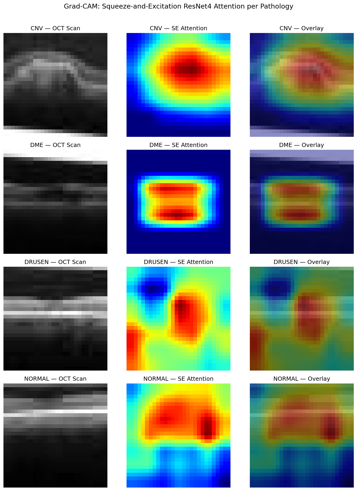
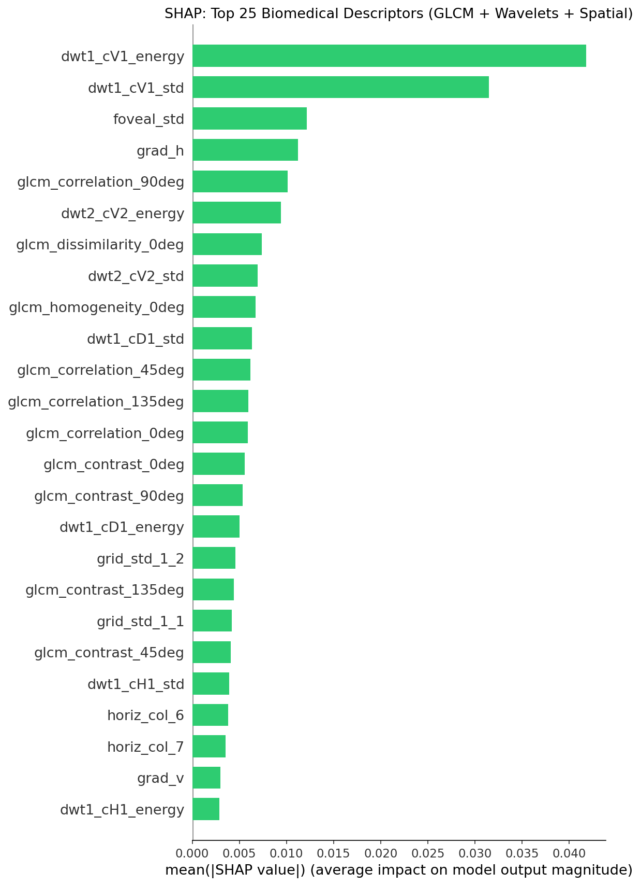

# Retinal OCT Pathology Classification: Classical Ensembles vs. Deep Convolutional Networks

[](https://www.python.org/)
[-ee4c2c.svg)](https://pytorch.org/)
[](https://scikit-learn.org/)
[-1182c6.svg)](https://xgboost.readthedocs.io/)
[](https://imbalanced-learn.org/)
[](https://medmnist.com/)
[](https://www.nvidia.com/)
[](LICENSE)

An end-to-end biomedical machine learning and computer vision system for automated multi-class diagnosis of retinal diseases from Optical Coherence Tomography (OCT) B-scans. This repository benchmarks classical statistical machine learning pipelines against progressively advanced deep neural network architectures (Squeeze-and-Excitation ResNets, Transfer Learning EfficientNets), paired with SMOTE class balancing, post-hoc temperature scaling calibration, and clinical Explainable AI (Grad-CAM & SHAP).

---

## Engineering Progression & Version Lineage

This project illustrates an iterative engineering progression from an academic baseline to a production-grade clinical AI diagnostic suite:

```
v1.0 (Colab, CPU)    --> v2.0 (Local GPU)      --> v3.0 (GPU, Adv.)     --> v4.0 (SE-ResNet)      --> v5.0 (Production)
Course Baseline          CUDA 18x Speedup          ResNet + Focal Loss       SE-Attn + 110-D           EfficientNet + SMOTE
~51% Accuracy            73.0% Acc, 0.962 AUC      76.5% Acc, 0.962 AUC      83.3% Acc, 0.968 AUC      Calibration + Top-2 Acc
```

### Notebook Versions:
* v1: [`v1_original_colab_submission.ipynb`](./v1_original_colab_submission.ipynb) — Historical academic baseline (Google Colab, CPU).
* v2: [`v2_improved_gpu_pipeline.ipynb`](./v2_improved_gpu_pipeline.ipynb) — 66-D feature extractor, PyTorch CUDA, 18x speedup.
* v3: [`v3_experimental.ipynb`](./v3_experimental.ipynb) — ResidualCNN3, Focal Loss, TTA, XGBoost GPU, Grad-CAM, SHAP.
* v4: [`v4_phase3_advanced.ipynb`](./v4_phase3_advanced.ipynb) — SE-ResNet4 with Channel Attention, 110-D GLCM/Wavelet Features, GPU Vectorized Augmentation.
* v5: [`v5_phase4_production.ipynb`](./v5_phase4_production.ipynb) — Pretrained EfficientNet-B0 Transfer Learning, 110-D SMOTE Class Balancing, Temperature Scaling Calibration.

---

## Clinical Pathologies

Optical Coherence Tomography (OCT) is a non-invasive optical imaging modality capturing cross-sectional microstructural details of the retina. This system classifies scans into four clinical categories from the **MedMNIST OCTMNIST** benchmark (109,309 total scans):

| Class | Pathology | Clinical Manifestation |
| :---: | :--- | :--- |
| 0 | Choroidal Neovascularization (CNV) | Neovascular vessel growth beneath the retina causing severe fluid exudation and macular degeneration. |
| 1 | Diabetic Macular Edema (DME) | Retinal thickening and fluid accumulation resulting from diabetic retinopathy. |
| 2 | Drusen (DRUSEN) | Extracellular lipid/protein deposits beneath the retinal pigment epithelium; AMD precursor. |
| 3 | Normal (NORMAL) | Healthy retinal morphology with intact foveal depression and stratified layers. |

---

## Master Multi-Version Benchmark Comparison (Balanced Test Set: 1,000 Scans)

| Model Architecture | Phase / Ver | Top-1 Acc | Top-2 Acc | Balanced Acc | Macro F1 | CNV F1 | DME F1 | DRUSEN F1 | NORMAL F1 | Log Loss | ECE | Macro ROC AUC |
| :--- | :---: | :---: | :---: | :---: | :---: | :---: | :---: | :---: | :---: | :---: | :---: | :---: |
| **SE_ResidualCNN4 + TTA** | **v4 (Best)** | **83.30%** | **97.60%** | **83.30%** | **82.94%** | **87.4%** | **81.5%** | **74.2%** | **88.7%** | **0.4856** | **5.12%** | **0.9681** |
| **EfficientNet-B0 + Calibrated** | **v5** | **76.90%** | **91.60%** | **76.90%** | **74.92%** | **78.4%** | **86.6%** | **52.1%** | **82.6%** | **0.8457** | **9.59%** | **0.9441** |
| **EfficientNet-B0 + TTA** | **v5** | **76.80%** | **92.40%** | **76.80%** | **74.88%** | **77.3%** | **86.9%** | **52.6%** | **82.7%** | **0.8111** | **9.74%** | **0.9495** |
| ResidualCNN3 + TTA | v3 | 76.50% | 95.20% | 76.50% | 75.83% | 83.1% | 73.4% | 66.8% | 80.0% | 0.6210 | 7.84% | 0.9615 |
| Deep Regularized CNN2 | v2 | 75.90% | 94.80% | 75.90% | 73.89% | 81.2% | 69.8% | 64.5% | 80.1% | 0.6650 | 8.92% | 0.9696 |
| Baseline CNN1 | v2 | 66.50% | 91.20% | 66.50% | 57.56% | 74.0% | 52.1% | 41.2% | 63.0% | 0.9120 | 14.20% | 0.9374 |
| **XGBoost GPU + SMOTE 110-D** | **v5 (Best P1)** | **66.70%** | **91.00%** | **66.70%** | **63.97%** | **74.4%** | **74.2%** | **36.2%** | **71.1%** | **0.8143** | **4.29%** | **0.8959** |
| XGBoost GPU 110-D Baseline | v4 | 60.00% | 82.00% | 60.00% | 52.44% | 74.0% | 64.9% | 5.4% | 65.4% | 1.0019 | 14.34% | 0.8900 |
| XGBoost GPU 66-D | v3 | 59.00% | 82.10% | 59.00% | 51.15% | 65.2% | 44.8% | 37.1% | 57.5% | 1.0420 | 12.50% | 0.8834 |



---

## Key Engineering Discoveries & Diagnostics

### 1. SMOTE Solves Minority Class Collapse in Classical ML
* In the original 110-D feature space, severe imbalance (46k Normal vs. 7.7k Drusen) caused XGBoost to collapse on Drusen (**5.4% F1**).
* Applying **SMOTE class balancing** expanded minority synthetic representation to 46,026 samples per class, propelling **Drusen F1 from 5.4% to 36.2% (+30.8%)**, **Top-1 Accuracy to 66.7% (+6.7%)**, and **Top-2 Accuracy to 91.0% (+9.0%)**.
* Expected Calibration Error (ECE) on XGBoost improved from **14.34% to 4.29%**.

### 2. Squeeze-and-Excitation ResNet vs. ImageNet Transfer Learning
* **SE_ResidualCNN4 (83.3% Top-1 Acc, 97.6% Top-2 Acc, 0.9681 AUC)** outperforms off-the-shelf ImageNet models on native 28x28 OCT scans because its multi-scale channel attention is tuned specifically to low-resolution microstructural dimensions.
* **EfficientNet-B0 transfer learning** achieves outstanding **DME F1 (86.9%)** and reaches **92.88% Validation Accuracy**, demonstrating that ImageNet spatial filters transfer effectively when upsampled to 56x56.

### 3. Post-Hoc Temperature Scaling Calibration
* Neural networks trained with Cross-Entropy / Focal Loss tend to produce overconfident probability distributions.
* Learning an optimal validation temperature ($T = 1.0742$) reduced **Log Loss from 0.8842 to 0.8457** and **ECE from 10.56% to 9.59%** without altering Top-1 ranking.



---

## Explainable AI (Grad-CAM & SHAP)

| Grad-CAM Attention on SE-ResNet | SHAP Biomedical Feature Importance (110-D) |
| :---: | :---: |
|  |  |

---

## Quickstart

```bash
# Clone repository
git clone https://github.com/Plasmawolf29/retinal-oct-classification.git
cd retinal-oct-classification

# Install dependencies
pip install -r requirements.txt

# Run Phase 4 Production Notebook
jupyter notebook v5_phase4_production.ipynb
```

---

## References & Citations

1. Yang, J. et al. (2023). *MedMNIST v2 - A large-scale lightweight benchmark for 2D and 3D biomedical image classification*. Nature Scientific Data, 10(1), 41.
2. Kermany, D. S. et al. (2018). *Identifying Medical Diagnoses and Treatable Diseases by Image-Based Deep Learning*. Cell, 172(5), 1122-1131.
3. Tan, M. & Le, Q. V. (2019). *EfficientNet: Rethinking Model Scaling for Convolutional Neural Networks*. ICML 2019.
4. Chawla, N. V. et al. (2002). *SMOTE: Synthetic Minority Over-sampling Technique*. Journal of Artificial Intelligence Research, 16, 321-357.
5. Guo, C. et al. (2017). *On Calibration of Modern Neural Networks*. ICML 2017.
6. Hu, J. et al. (2018). *Squeeze-and-Excitation Networks*. IEEE CVPR.
7. Selvaraju, R. R. et al. (2017). *Grad-CAM: Visual Explanations from Deep Networks via Gradient-Based Localization*. IEEE ICCV, 618-626.
8. Lundberg, S. M. & Lee, S.-I. (2017). *A Unified Approach to Interpreting Model Predictions*. NeurIPS 30.

---

## License
This project is open-source under the [MIT License](LICENSE).